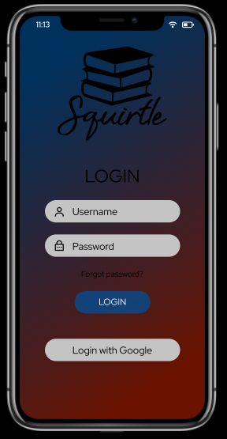
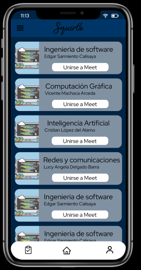
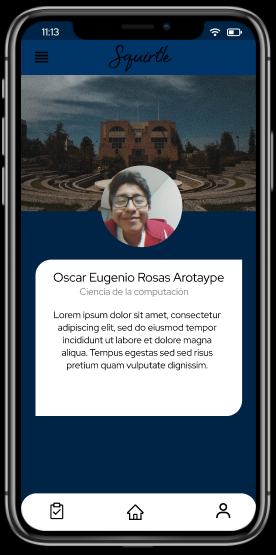

# SQUIRTLE

Squirtle es una app que muestra de una forma mas amigable e intuitiva la plataforma de Moodle (DUTIC), además de contar con funcionalidades extra para la creación de tareas.\
El objetivo de Squirtle es brindar una mejor experiencia a los alumnos de la Universidad Nacional de San Agustin de Arequipa.

## Uso de la API

Se esta haciendo uso de la API de Moodle, especificamente DUTIC, esta app fue hecha solo con fines academicos.

## Prototipo

Para la realizacion del prototipo y modelo de vistas se usó [Figma](https://www.figma.com/), lo cual permitió poder trabar en equipo y en tiempo real para la realización de cada una de las vista.
Puede visitar la vista del prototipo en el siguiente link [Prototipo Squirtle](https://www.figma.com/proto/uAWgtoCADSGCwFNSTRPyIJ/Squirtle?node-id=6%3A2&viewport=346%2C306%2C0.2773333191871643&scaling=scale-down).

  

## Construccion

Se hizo uso del framework [Flutter](https://flutter.dev/).

## Funcionalidades

Por el momento se pueden hacer las funciones de:

- Login de un usario
- Ver el lista de cursos
- Ver la información de temas de cada curso
- Ver tareas
- Crear tareas
- Ver el perfil de usuario

## Estilos de programación

### Restful

```dart
class Server {
  static const String LoginURL =
      "https://aulavirtual.unsa.edu.pe/aulavirtual/login/token.php";
  static const String ServerURL =
      "https://aulavirtual.unsa.edu.pe/aulavirtual/webservice/rest/server.php";
  // Services
  static const String LoginService = 'moodle_mobile_app';
  static const String InfoService = 'core_webservice_get_site_info';
  static const String CoursesFunction = 'core_enrol_get_users_courses';
}

Future<dynamic> serviceLogin({@required dynamic body}) async {
  var url = Server.LoginURL;
  var response = await http.post(url, body: body);
  return json.decode(response.body);
}

Future<dynamic> service({@required dynamic body}) async {
  var url = Server.ServerURL;
  var response = await http.post(url, body: body);
  return json.decode(response.body);
}
```

### Cookbook
```dart
import 'dart:typed_data';

import 'package:opencv/core/core.dart';
import 'package:opencv/core/imgproc.dart';

Future<Uint8List> cannyContours(
    {Uint8List image, double minT, double maxT}) async {
  dynamic ima = await ImgProc.cvtColor(image, ImgProc.colorBGR2GRAY);
  
  ima = await ImgProc.gaussianBlur(ima, [5.0,5.0],0);
  //ima = await ImgProc.bilateralFilter(ima, 9, 75, 75, Core.borderConstant);
  //ima = await ImgProc.adaptiveThreshold(ima, 255,
  // ImgProc.adaptiveThreshGaussianC, ImgProc.threshBinary, 7, 15);
  //ima = await ImgProc.medianBlur(ima, 5);
  ima = await ImgProc.canny(ima, minT, maxT);
  //ima = await ImgProc.threshold(ima, 120, 255, ImgProc.threshBinary);
  //ima = await ImgProc.dilate(ima, [1, 1]);
  //ima = await ImgProc.erode(ima, [1, 1]);
  return ima;
}

Future<dynamic> findContours({Uint8List image, double minT, double maxT}) async {
  
  Uint8List ima = await cannyContours(image: image,minT: minT, maxT: maxT);
  dynamic edges = await ImgProc.onlyFindContours(ima);
  return edges;
}
```

### Trinity

```dart
onPressed: () {
    if (_formKey.currentState.validate()) {
        _formKey.currentState.save();
        User userTemp = Provider.of<UserProvider>(context,listen: false).userLogin;
        Scaffold.of(context).showSnackBar(
            SnackBar(
              content: Text('Procesando...'),
            ),
        );

        loginService(username: userTemp.username, password: userTemp.password)
            .then((value) {
        if (value.containsKey('error')) {
            Scaffold.of(context).showSnackBar(
                SnackBar(
                    content: Text('User or Password invalid'),
                ),
            );
        } else {
            userInfoService(token: value['token']).then((response) {
                if (response.containsKey('exception') || response == null) {
                    Scaffold.of(context).showSnackBar(
                        SnackBar(
                            content: Text('Error accediendo a DUTIC'),
                        ),
                    );
                } else {
                    User userTempInfo = User.fromJSON(response);
                    userTempInfo.username = userTemp.username;
                    userTempInfo.password = userTemp.password;
                    userTempInfo.token = value['token'];
                    Provider.of<UserProvider>(context, listen: false).user = userTempInfo;

                    Navigator.pushNamedAndRemoveUntil(
                        context,
                        Routes.MobileRoute,
                        (Route<dynamic> route) => false,
                    );
                }
            });
        }
    });
}
```

## S.O.L.I.D

### S — Single Responsibility
### I — Interface Segregation

```dart
class Server {
  static const String LoginURL =
      "https://aulavirtual.unsa.edu.pe/aulavirtual/login/token.php";
  static const String ServerURL =
      "https://aulavirtual.unsa.edu.pe/aulavirtual/webservice/rest/server.php";
  // Services
  static const String LoginService = 'moodle_mobile_app';
  static const String InfoService = 'core_webservice_get_site_info';
  static const String CoursesFunction = 'core_enrol_get_users_courses';
  static const String CourseInfoFunction = 'core_course_get_contents';
  static const String TaskFunction = 'mod_assign_get_assignments';

  Future<dynamic> serviceLogin({@required dynamic body}) async {
    var url = Server.LoginURL;
    var response = await http.post(url, body: body);
    return json.decode(response.body);
  }

  Future<dynamic> service({@required dynamic body}) async {
    var url = Server.ServerURL;
    var response = await http.post(url, body: body);
    return json.decode(response.body);
  }

  Future<dynamic> userInfoService({@required String token}) async {
    var body = {
      'wsfunction': Server.InfoService,
      'moodlewsrestformat': 'json',
      'wstoken': token,
    };
    return service(body: body);
  }
}
```

### D — Dependency Inversion

- profile
  - components
    - backProfile.dart
    - description.dart
    - photoProfile.dart
  - profile.dart

## DDD

### Lenguaje ubicuo

```dart
Future<void> updateImage(Uint8List imgTemp) async {
    Provider.of<ImagenProvider>(context, listen: false).image.uint8 = imgTemp;
    Provider.of<ImagenProvider>(context, listen: false).image.imageObjet =
        imgPack.decodeImage(imgTemp);
    final directory = await getApplicationDocumentsDirectory();
    String name = "${directory.path}/${DateTime.now().toString()}.jpg";
    File(name).writeAsBytesSync(imgTemp);
    Provider.of<ImagenProvider>(context, listen: false).image.imageFile =
        File(name);

    setState(() {
      this.img = imgTemp;
      isCropImage = false;
    });
  }

Array2d getAffine(List<Point> src, List<Point> dst) {
  Array2d A = matrixZeros(6, 6);
  Array2d B = matrixZeros(6, 1);
  Array2d M = matrixZeros(2, 3);

  for (int i = 0; i < 3; i++) {
    A[i][0] = A[i + 3][3] = src[i].px;
    A[i][1] = A[i + 3][4] = src[i].py;

    A[i][2] = A[i + 3][5] = 1;
    B[i][0] = dst[i].px;
    B[i + 3][0] = dst[i].py;
  }
  Array2d invA = matrixInverse(A);
  Array2d X = matrixDot(invA, B);
  int a = 0;
  for (int i = 0; i < 2; i++) {
    for (int j = 0; j < 3; j++) {
      M[i][j] = X[a][0];
      a++;
    }
  }
  return M;
}
```

### Entidades

```dart
class User {
  String firstname;
  String lastname;
  String urlPhoto;
  String urlPortada;
  String about;
  String token;
  String username;
  String password;
  String userID;
  ...
}
class Course {
  String name;
  String teacher;
  String photo;
  String courseID;
  int userCount;
  double progress;

  List<Tema> temasList = [];
  List<Task> tasksList = [];

  Course({
    @required this.name,
    @required this.courseID,
    this.teacher,
    this.photo,
    this.userCount,
    this.progress,
  });
}
```

### Objetos de valor

```dart
class Tema {
  String id;
  String name;
  List<Module> modules = [];

  Tema({this.id, this.name, this.modules});

  factory Tema.fromJSON(Map<String, dynamic> response) {
    return Tema(
      name: response['name'],
      id: response['id'].toString(),
      modules: buildModules(response['modules']),
    );
  }
}
class Module {
  String idModule;
  String name;
  String modname;
  List<Content> contents = [];

  Module({this.idModule, this.name, this.modname, this.contents});

  factory Module.fromJSON(Map<String, dynamic> response) {
    return Module(
      name: response['name'],
      idModule: response['id'].toString(),
      modname: response['modname'],
      contents: response.containsKey('contents')
          ? buildContents(response['contents'])
          : [],
    );
  }
}
```

### Servicios

```dart
Future<dynamic> loginService(
    {@required String username, @required String password}) async {
  var url = Server.LoginURL;
  var valueJSON;
  var response = await http.post(url, body: {
    'username': username,
    'password': password,
    'service': Server.LoginService,
  });
  print('Response status: ${response.statusCode}');
  print('Response body: ${response.body}');
  valueJSON = json.decode(response.body);
  
  return valueJSON;
}
Future<dynamic> userInfoService({@required String token}) async {
  var body = {
    'wsfunction': Server.InfoService,
    'moodlewsrestformat': 'json',
    'wstoken': token,
  };
  return service(body: body);
}

Future<dynamic> userCoursesService({@required String token,@required String userid}) async {
  var body = {
    'wsfunction': Server.CoursesFunction,
    'moodlewsrestformat': 'json',
    'wstoken': token,
    'userid': userid,
  };
  return service(body: body);
}
```

### Modulos

- scanner
  - algorithms
    - affine.dart
    - cannyContours.dart
  - components
    - rotateImage.dart
    - textRecognition.dart
  - utils
    - points.dart
    - pointsPaint.dart
  - scanner.dart

### Factorías

```dart
factory Course.fromJSON(Map<String, dynamic> response) {
    return Course(
      name: onlyCourseName(response['fullname']),
      courseID: response['id'].toString(),
    );
}
factory Tema.fromJSON(Map<String, dynamic> response) {
    return Tema(
      name: response['name'],
      id: response['id'].toString(),
      modules: buildModules(response['modules']),
    );
  }
factory User.fromJSON(Map<String,dynamic> response){
    return User(
      firstname: response['firstname'],
      lastname: response['lastname'],
      userID: response['userid'].toString(),
      urlPhoto: response['userpictureurl'],
    );
}
void taskFromJSON(dynamic data){
    List listData = data['courses'] as List;
    for (int i = 0; i < listData.length; i++) {
      int index = getIndex(listData[i]['id'].toString());
      List listTask = listData[i]['assignments'] as List;
      for (int j = 0; j < listTask.length; j++){
        Task taskTemp = Task.fromJSON(listTask[j]);
        listCourses[index].tasksList.add(taskTemp);
      }
    }
    //notifyListeners();
}
```

### Repositorios

```dart
class UserProvider with ChangeNotifier {
  User user = User();
  User userLogin;

  void editProfile(User temp) {
    this.user = temp;
    notifyListeners();
  }
}

class CourseProvider with ChangeNotifier {
  List<Course> listCourses = [];

  void addCourse(Course newCourse) {
    listCourses.add(newCourse);
    notifyListeners();
  }

  void coursesFromJSON(dynamic data) {
    List listData = data as List;
    for (int i = 0; i < listData.length; i++) {
      Course courseTemp = Course.fromJSON(listData[i]);
      listCourses.add(courseTemp);
    }
    notifyListeners();
  }
}
```
